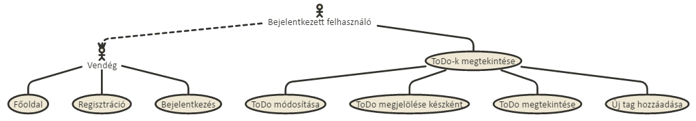
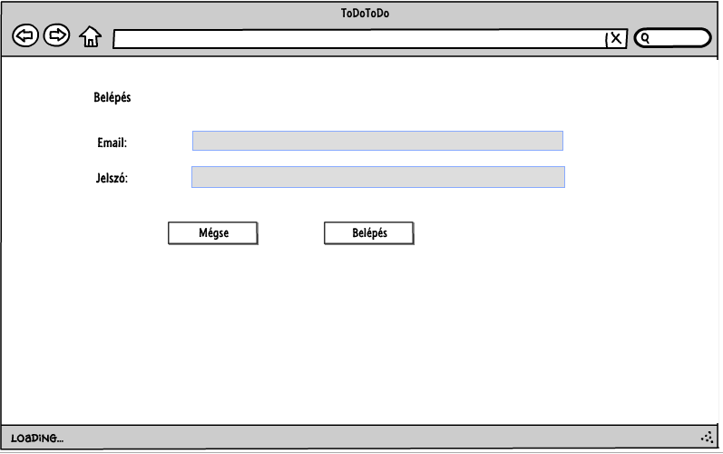

# webprog-beadando

A választott beadandó feladat:

<h1>TO-DO alkalmazás fejlesztése</h1>

<h2>Funkcionális követelmények:</h2>
A beadandó program célja az adatbázisba felvitt feladatok/tennivalók megjelenítése, valamint azok megjelölése elvégzettként, törlése.   

Felhasználóként szeretnék elvégzendő feladatot/tennivalót hozzáadni -> Feladat hozzáadása  
Felhasználóként szeretném megjelelölni az elvégzett feladatokat, vagy törölni azokat. -> Feladat törlése  
Felhasználóként szeretném tudni csoportosítani a feladataimat -> Feladatok csoportosítása  
Felhasználóként szeretném, ha az alkalmazás listázná a legkorábban feltöltött és még nem elvégzett feladataimat -> Feladatok megtekintése  

A felhasználó bejelentkezés után:
 - Tennivalót adhat hozzá a listájához
 - Tennivalót törölhet, jelölhet meg elvégzettként, vagy jelölheti meg magas prioritásuként
 - Megtekintheti a hozzáadott feladatait, valamint módosíthatja azokat

Amennyiben a felhasználó még nem jelentkezett be, úgy az oldalon megjelenik egy ismertető, amely leírja az alkalmazás fontosabb funkciót,
valamint azok működését

<h2>Nem funkcionális követelmények:</h2>
<ul>
<li>Felhasználóbarát, modern megjelenés</li>
<li>Gyors működés</li>
<li>Biztonságos működés</li>
</ul>

<h2> Szakterületi fogalomjegyzék: </h2>
<b> ToDo: </b> Az elvégzendő tevékenység leírásá szolgál.

<h2> Használatieset-modell, funkcionális követelmények </h2>

<b> Vendég: </b> 
<ul>
 <li> Az oldalt megtekintheti, azonban mivel a funkciók csak bejelentkezés után érhetőek el, így nem tud ToDo-t létrehozni, módosítani </li>
 <li> Regisztráció </li>
 <li> Bejelentkezés </li>
 </ul>
 
 <b> Bejelentkezett felhasználó: </b>
 <ul>
 <li> A publikus oldalakon kívül hozzáfér további opciókhoz is. </li>
 <li> ToDo létrehozása </li>
 <li> ToDo-k megtekintése </li>
 <li> ToDo módosítása </li>
 <li> ToDo megjelölése elvégzettként </li>
 </ul>

 <h2> ToDo módosítása </h2>
 <ol>
 <li> Az oldalra érkezett vendég regisztrál, vagy bejelentkezik </li>
 <li> Amennyiben már regisztrált és adott hozzá tevékenységet, úgy a következőket teheti: </li>
 <ul> 
  <li> Megtekintheti az eddig hozzáadott ToDo-jait
  <li> A ToDo neve melletti módosít gombra kattintva módosíthatja azt
  <li> A ToDo neve melletti kész gombra kattintva elvégzettnek tekintheti az adott tevékenységet, mely ezáltal törlésre kerül
 </ul>
 <li> Amennyiben a módosít gombra kattintott úgy megjelenik számára a módosító felület, melyen átírhatja a ToDo nevét, leírását, valamint megváltoztathatja annak kategóriáját.
 <li> Az új adatok bevitele után az elküld gombra kattintva a ToDo módosításai mentésre kerülnek
 </ol>
 </ul>
 </ol>
 
 

<h1>
Tervezés
</h1>

<h2>
Architektúra modell
</h2>

<h3> Komponens diagram </h3>

<h2>
Oldaltérkép </h2>

<b> Publikus: </b>
<ul>
 <li> Főoldal
 <li> Regisztráció
 <li> Bejelentkezés
</ul>

<b> Bejelentkezett: </b>
<ul>
 <li> Főoldal </li>
 <li> ToDo-k megtekintése </li>
 <ul>
 <li> Új ToDo felvétele </li>
 <li> ToDo módosítása </li>
 <li> ToDó megjelölése kész-ként </li>
 </ul>
</ul>

<h2>
Végpontok </h2>
<ul> 
 <li> GET/: főoldal </li>
 <li> GET/todos/create: Új ToDo felvétele </li>
 <li> POST/todos/create: Új ToDo felvételehéz adatok felküldése </li>
 <li> GET/showmytodos: ToDo-k megjelenítése</li>
 <li> GET/:id/: ToDo megtekintése </li>
 <li> GET/todos/:id/modify: ToDo módosítása </li>
 <li> POST/todos/:id/modify: ToDo módosítása adatok felküldése </li>
 <li> GET/todos/:id/markAsComplete: ToDo megjelölése kész-ként </li>
 <li> GET/todos/todoNotFound: Annak jelzésére, ha a kért ToDo nem található </li>
 <li> GET/register: Felhasználó regisztrálása</li>
 <li> POST/register: Felhasználó regisztrálásához adatok felküldése </li>
 <li> GET/login: Felhasználó bejelentkeztetése</li>
 <li> POST/login: Felhasználó bejelentkeztetéséhez adatok felküldése</li>
 <li> POST/logout: Felhasználó kijelentkeztetéséhez adatok felküldése)</li>
 <li> GET/accessDenied: Annak jelzésére, ha az adott felhasználónak nincs joga)</li>
 <li> GET/todos/:id/comment: Megjegyzés írása</li>
 <li> POST/todos/:id/comment: Megjegyzés írásához adatok felküldése</li>
 <li> GET/comments/:id/delete: Megjegyzés törlése</li>
 <li> GET/comments/:id/modify: Megjegyzés módosítása</li>
 <li> POST/comments/:id/modify: Megjegyzés módosításához adatok felküldése</li>
 <li> GET/profile/:id: Felhasználó profiljának megtekintése</li>
 <li> POST/profile/:id: Felhasználó profiljának módosításához adatok felküldése</li>
 <li> GET/profile/:id/delete:  Felhasználó profiljának törlése</li>
 <li> GET/comments/:id/modify: Megjegyzés módosítása </li>
 <li> POST/comments/:id/modify: Megjegyzés módosításához adatok felküldése</li>
 <li> GET/profile/:id: Felhasználó profiljának megtekintése</li>
 <li> POST/profile/:id: Felhasználó profiljának megtekintése és módosítása</li>
 <li> GET/profile/:id/delete: Felhasználó törlése</li>
 <li> GET/todos/:id/addNewMember: Új felhasználó hozzáadása a ToDo-hoz</li>
 <li> POST/todos/:id/addNewMember: Új felhasználó hozzáadása a ToDo-hoz - adatok felküldése </li>
</ul>

<h2>Drótvázterv </h2>
</h3>Főoldal</h3>

 
</h3>Regisztrációs oldal</h3>
 
</h3>Bejelentkezési oldal</h3>
 
</h3>Új ToDo hozzáadása oldal</h3>
 
</h3>ToDo módosítása oldal</h3>
 
</h3>ToDo-im megtekintése</h3>
 
</h3>ToDo megtekintése</h3>
 
</h3>Komment hozzáadása</h3>
 
</h3>Tag hozzáadása</h3>
 
</h3>Profil megtekintése</h3>

 

<h2>Dizájntervek </h2>
</h3>Főoldal</h3>

 
</h3>Regisztrációs oldal</h3>
 
</h3>Bejelentkezési oldal</h3>
 
</h3>Új ToDo hozzáadása oldal</h3>
 
</h3>ToDo módosítása oldal</h3>
 
</h3>ToDo-im megtekintése</h3>
 
</h3>ToDo megtekintése</h3>
 
</h3>Komment hozzáadása</h3>
 
</h3>Tag hozzáadása</h3>
 
</h3>Profil megtekintése</h3>

 

<h2> Adatmodell </h2>
 

<h2> Szekvenciadiagram </h2>
<h3>Például: Regisztráció, új ToDO, szerkesztés, törlés</h3>
 ű

<h1> Implementáció </h1>

<h3> Fejlesztőkörnyezet: Visual Studio Code </h3>
<ul>
<li> Szükséges függőséges telepítése után elkezdhetjük a kód írását </li>
<li> A commitolás github-ra is a Visual Studio Code-ban történik a Git ikonra kattintva stage-elni majd push-olni kell az egyes változtatásokat

<h3> Könyvtárstruktúra </h3>
ToDoBead
<ul>
<li>
 controllers
  <ul>
  <li>UserController.js</li>
    <li>ToDoController.js</li>
      <li>CommentController.js</li>
  </ul>
 </li>
 
 <li>
 models
  <ul>
  <li>Category.js</li>
    <li>Comment.js</li>
      <li>Family.js</li>
        <li>ToDo.js</li>
    <li>Token.js</li>
      <li>User.js</li>
  </ul>
 </li>
  <li>
 views(.njk (nunjucks) fájlok)
  <ul>
  <li>accessDenied.njk</li>
    <li>addFamilyMember.njk</li>
      <li>createToDo.njk</li>
        <li>layout.njk</li>
    <li>login.njk</li>
      <li>main.njk</li>
          <li>master.njk</li>
      <li>modifyComment.njk</li>
        <li>modifyToDo.njk</li>
    <li>register.njk</li>
      <li>showMyToDos.njk</li>
                <li>showSharedToDo.njk</li>
      <li>showToDo.njk</li>
        <li>showUser.njk</li>
    <li>todoNotFound.njk</li>
      <li>welcome.njk</li>
            <li>writeComment.njk</li>
  </ul>
    <li>
 views(.njk (nunjucks) fájlok)
  <ul>
  <li>accessDenied.njk</li>
    <li>addFamilyMember.njk</li>
      <li>createToDo.njk</li>
        <li>layout.njk</li>
    <li>login.njk</li>
      <li>main.njk</li>
          <li>master.njk</li>
      <li>modifyComment.njk</li>
        <li>modifyToDo.njk</li>
    <li>register.njk</li>
      <li>showMyToDos.njk</li>
                <li>showSharedToDo.njk</li>
      <li>showToDo.njk</li>
        <li>showUser.njk</li>
    <li>todoNotFound.njk</li>
      <li>welcome.njk</li>
            <li>writeComment.njk</li>
  </ul>
  <li>
   server.js
  </li>
    <li>
   package.json
  </li>

  
 </li>
 </ul>

<h1> Felhasználói dokumentáció </h1>

<b> Futtatáshoz szükséges operációs rendszer:  </b>Tetszőleges operációs rendszer  
<b> A futtatáshoz szükséges hardver: </b> Operációs rendszerek szerint megadva  
<b> Egyéb követelmények: </b> Internet böngésző  

<b> Program használata: </b>  

<li> 1. Böngészőben nyissuk meg a főoldalt </li>
<li> 2. Regisztráljunk az oldalon, amennyiben azt még nem tettük meg - jobb felső sarokban levő regisztráció gombra kattintva</li>
<li> 3. Amennyiben már regisztráltunk és még nem vagyunk bejelentkezve, úgy jelentkezzünk be a Bejelentkezés gombra kattintva </li>
<li> 4.Bejelentkezés után az Új ToDo gombra kattintva tudunk új feladatot létrehozni </li>
<li> 5. Töltsük ki a ToDo jellemzőit </li>
<li> 6. Hiba esetén az oldal jelezni fogja azt </li>
<li> 7. Mentsük el a ToDo-t </li>
<li> 8. A saját ToDo-im oldalon megjelennek a már létrehozott ToDo-k, valamint a mások által megosztottak is </li>
<li> 9. A ToDo nevére kattintva tudjuk megtekinteni az egyes ToDo-kat </li>
<li> 10. Kész gombbal tudunk törölni egy-egy ToDo-t </li>
<li> 11. Módosít gombbal tudunk módosítani egy-egy ToDo-t </li>
<li> 12. ToDo megtekintése oldalon az új megjegyzés hozzáadása gombra kattintva tudunk új megjegyzést hozzáadni </li>
<li> 13. Az "Új tag hozzáadása" gombra kattintva egy új tagot tudunk hozzáadni a ToDo-nkhoz akivel meg szeretnénk osztani azt </li>

